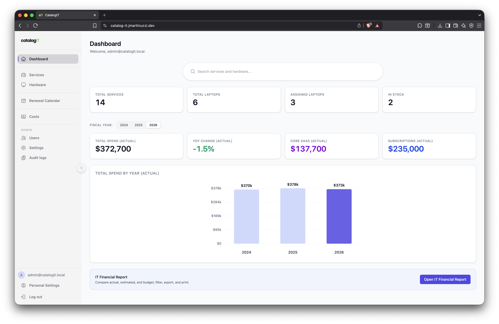
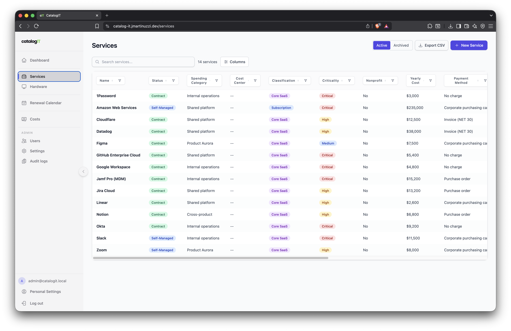
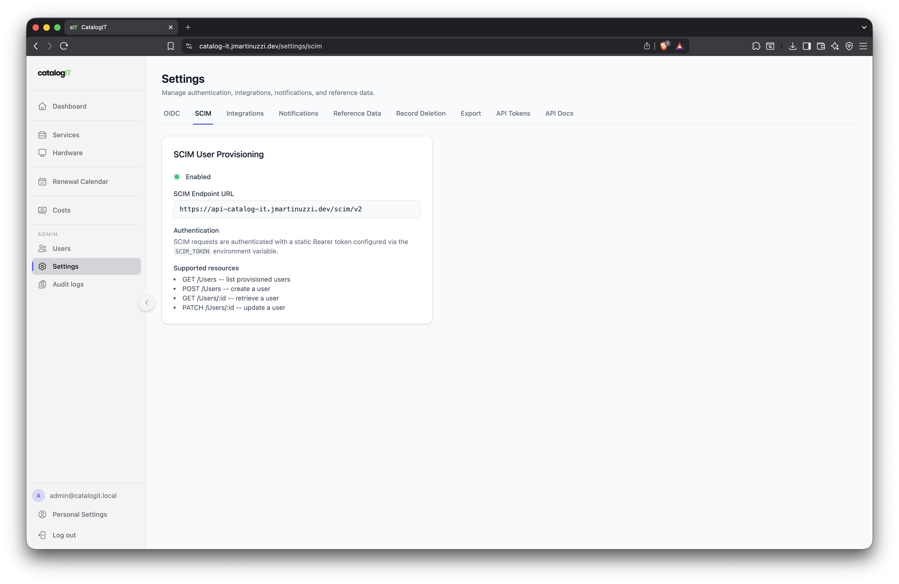

**Open-source IT service catalog and hardware inventory for modern teams.**

**[Live demo](https://catalog-it.jmartinuzzi.dev/)** — `admin@catalogit.local` / `admindemo` · sandbox resets every 12 hours

---

CatalogIT helps organizations track their SaaS subscriptions, cloud services, and hardware assets in one place. It provides cost tracking, renewal management, vendor oversight, and a full audit trail — self-hosted, with enterprise SSO and provisioning built in.

## Features

- **Service Catalog** — track services with cost, renewal dates, vendors, owners, and classifications
- **Hardware Inventory** — manage laptops and devices with assignment tracking
- **Renewal Calendar** — visual calendar view for upcoming renewals
- **SSO & Provisioning** — OIDC single sign-on (Okta) with SCIM 2.0 automatic user provisioning
- **Role-Based Access** — admin and regular user roles with fine-grained permissions
- **Audit Logging** — comprehensive change history with configurable retention policies
- **Notifications** — renewal reminders and alerts via Gmail, Slack, Telegram, or webhooks ([email templates](docs/email-templates.md))
- **File Attachments** — attach contracts and documents to services (S3-compatible storage)
- **API Tokens** — programmatic access for automation and integrations
- **Backup & Restore** — complete tooling for database and object storage backups

## Live demo

A shared **[CatalogIT demo](https://catalog-it.jmartinuzzi.dev/)** is available so you can explore the app without installing anything.


|             |                                                                                          |
| ----------- | ---------------------------------------------------------------------------------------- |
| **URL**     | [https://catalog-it.jmartinuzzi.dev/](https://catalog-it.jmartinuzzi.dev/)               |
| **Sign in** | Email **admin@catalogit.local** and password **admindemo**                             |
| **Sandbox** | The instance refreshes on a **12-hour** schedule; **all data is reset** on each refresh. |


Treat it as a throwaway environment: do not store real or sensitive information.

## Screenshots

### Dashboard



### Services



### Settings (SCIM)



## Tech Stack


| Layer    | Technology                                          |
| -------- | --------------------------------------------------- |
| Backend  | FastAPI, SQLAlchemy (async), Alembic, Uvicorn       |
| Frontend | React 19, TypeScript, Vite, Tailwind CSS            |
| Database | PostgreSQL 16                                       |
| Auth     | OIDC + SCIM 2.0, local password fallback            |
| Storage  | S3-compatible (MinIO locally, AWS S3 in production) |


## Quick Start

### Prerequisites

- Docker and Docker Compose
- [uv](https://docs.astral.sh/uv/) (Python package manager)
- Node.js 20+ and npm

### Setup

```bash
# Clone the repository
git clone https://github.com/jcoponet/catalogIT.git
cd catalogIT

# Configure environment
cp .env.example .env
# Edit .env with your values

# Start all services
docker compose up --build
```

Once running:


| Service            | URL                                                      |
| ------------------ | -------------------------------------------------------- |
| Frontend           | [http://localhost:5173](http://localhost:5173)           |
| API                | [http://localhost:8000](http://localhost:8000)           |
| API Docs (Swagger) | [http://localhost:8000/docs](http://localhost:8000/docs) |
| MinIO Console      | [http://localhost:9001](http://localhost:9001)           |


### Database migrations

The API runs `**alembic upgrade head` automatically on startup**, so a manual step is usually unnecessary. To apply migrations yourself (for example if the container failed mid-boot):

```bash
docker compose exec api alembic upgrade head
```

### Sample data (optional)

CatalogIT can load **bundled demo data** on the **first** API startup when the database has **no services** yet (empty catalog). This is controlled by `**SEED_SAMPLE_DATA`** (see `.env.example`).


| Location                         | Role                                                                                                                                                                                              |
| -------------------------------- | ------------------------------------------------------------------------------------------------------------------------------------------------------------------------------------------------- |
| `**backend/sample_data/*.json`** | Source files in the repo (vendors, categories, payment methods, users, services including **yearly cost**, fiscal **cost records**, **service history**, **laptops**, **laptop hardware costs**). |
| **Docker API image**             | Same JSON is copied to `**/app/sample_data`**; the container sets `**SEED_DIR`** to that path.                                                                                                    |
| `**placeholder data/**`          | Symlinks to `backend/sample_data` plus `**bulk_load_api.py**` / `**purge_catalog_api.py**` for loading or clearing via the HTTP API (useful when you cannot run the DB seed script directly).     |


**Local development:** set `SEED_SAMPLE_DATA=true` in `.env`, start the stack, log in with the bootstrap admin from `.env`, and explore the pre-filled catalog and hardware.

**Production:** prefer `SEED_SAMPLE_DATA=false` after the first deploy if you do not want the demo catalog on new empty databases. The production compose file (`[docker-compose.server.yml](docker-compose.server.yml)`) defaults this to false.

**Releases:** multi-arch images are built with `**make release`** or `**docker buildx bake`** (see `[docker-bake.hcl](docker-bake.hcl)`); images are tagged with the release version and `**latest**`. For server deploys you can pin `**CATALOGIT_TAG**` (for example `1.1.1`) so `docker-compose.server.yml` pulls a specific tag instead of `latest`.

## Documentation


| Topic                                                      | Guide                                                                          |
| ---------------------------------------------------------- | ------------------------------------------------------------------------------ |
| **Email templates** (subject, HTML upload, logos, preview) | [docs/email-templates.md](docs/email-templates.md)                             |
| Integrations overview                                      | [docs/integrations/README.md](docs/integrations/README.md)                     |
| Gmail setup                                                | [docs/integrations/gmail.md](docs/integrations/gmail.md)                       |
| Slack setup                                                | [docs/integrations/slack.md](docs/integrations/slack.md)                       |
| Telegram setup                                             | [docs/integrations/telegram.md](docs/integrations/telegram.md)                 |
| Webhook setup                                              | [docs/integrations/webhook.md](docs/integrations/webhook.md)                   |
| Backup & Restore                                           | [docs/operations/backup-and-restore.md](docs/operations/backup-and-restore.md) |


## Operations

- **Logging** — the API logs to stdout. Set `LOG_FORMAT=json` for structured JSON output. On AWS ECS, use the `awslogs` driver or FireLens to ship logs to CloudWatch.
- **Renewal reminders** — connect Gmail under **Settings → Integrations**, edit templates under **Settings → Notifications** ([guide](docs/email-templates.md)), then call `POST /api/internal/notifications/renewal-dispatch` with the `X-Cron-Secret` header on a daily schedule.
- **Audit retention** — rows older than `AUDIT_RETENTION_DAYS` (default 90) are purged via `POST /api/internal/audit-retention` with the same `X-Cron-Secret` header.
- **Backups** — run `make backup-local` for a one-command database dump and bucket mirror. See [Backup & Restore](docs/operations/backup-and-restore.md) for production procedures.

## Project Structure

```
catalogIT/
├── backend/           # FastAPI application
│   ├── app/           # Source code (routers, models, schemas)
│   ├── alembic/       # Database migrations
│   ├── sample_data/   # Optional seed JSON (bundled in API image for SEED_SAMPLE_DATA)
│   └── Dockerfile
├── frontend/          # React (Vite) application
│   ├── src/           # Components, pages, hooks, types
│   └── Dockerfile
├── docs/
│   ├── email-templates.md  # How to customize and upload email HTML
│   ├── integrations/       # Gmail, Slack, Telegram, webhook guides
│   └── operations/         # Backup and restore procedures
├── email-templates/        # Canned HTML you can copy, edit, and upload in the app
├── branding/          # Logo assets (light/dark, horizontal/square)
├── screenshots/       # README screenshots (live demo)
├── scripts/           # Utility scripts (backup, etc.)
├── docker-compose.yml
├── docker-compose.server.yml  # Production-oriented stack (pinned images via CATALOGIT_TAG)
├── docker-bake.hcl    # Multi-arch image build (API + UI; version + latest tags)
├── Makefile           # e.g. make release — push images; make backup-local
└── .env.example       # Environment variable template
```

## Contributing

Contributions are welcome! To get started:

1. Fork the repository
2. Create a feature branch (`git checkout -b feature/my-feature`)
3. Commit your changes
4. Open a pull request

## License

CatalogIT is licensed under the [GNU Affero General Public License v3.0](LICENSE).

You are free to use, modify, and distribute CatalogIT. If you run a modified version as a network service, you must make the source code available to its users. See the [LICENSE](LICENSE) file for details.