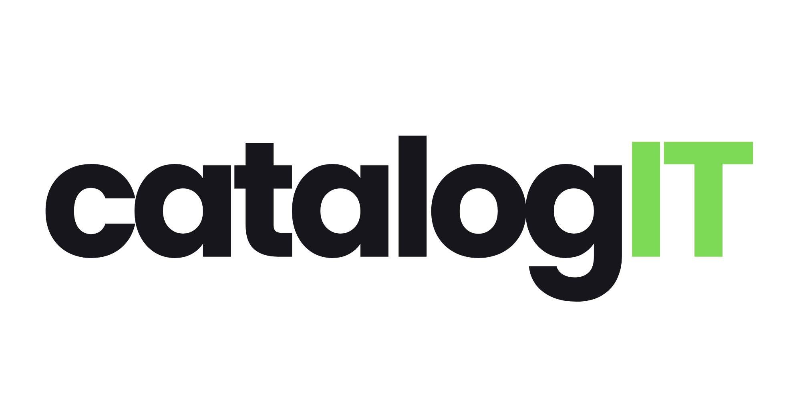

<p align="center">
  <a href="https://github.com/jcoponet/catalogIT">
    
  </a>
</p>

<p align="center">
  <strong>Open-source IT service catalog and hardware inventory for modern teams.</strong>
</p>

<p align="center">
  <a href="LICENSE"></a>
  
  
  
  
</p>

---

CatalogIT helps organizations track their SaaS subscriptions, cloud services, and hardware assets in one place. It provides cost tracking, renewal management, vendor oversight, and a full audit trail — self-hosted, with enterprise SSO and provisioning built in.

## Features

- **Service Catalog** — track services with cost, renewal dates, vendors, owners, and classifications
- **Hardware Inventory** — manage laptops and devices with assignment tracking
- **Renewal Calendar** — visual calendar view for upcoming renewals
- **SSO & Provisioning** — OIDC single sign-on (Okta) with SCIM 2.0 automatic user provisioning
- **Role-Based Access** — admin and regular user roles with fine-grained permissions
- **Audit Logging** — comprehensive change history with configurable retention policies
- **Notifications** — renewal reminders and alerts via Gmail, Slack, Telegram, or webhooks ([email templates](docs/email-templates.md))
- **File Attachments** — attach contracts and documents to services (S3-compatible storage)
- **API Tokens** — programmatic access for automation and integrations
- **Backup & Restore** — complete tooling for database and object storage backups

## Screenshots

> Screenshots coming soon. Run the [Quick Start](#quick-start) to see CatalogIT in action.

## Tech Stack

| Layer | Technology |
|-------|-----------|
| Backend | FastAPI, SQLAlchemy (async), Alembic, Uvicorn |
| Frontend | React 19, TypeScript, Vite, Tailwind CSS |
| Database | PostgreSQL 16 |
| Auth | OIDC (Okta) + SCIM 2.0, local password fallback |
| Storage | S3-compatible (MinIO locally, AWS S3 in production) |

## Quick Start

### Prerequisites

- Docker and Docker Compose
- [uv](https://docs.astral.sh/uv/) (Python package manager)
- Node.js 20+ and npm

### Setup

```bash
# Clone the repository
git clone https://github.com/jcoponet/catalogIT.git
cd catalogIT

# Configure environment
cp .env.example .env
# Edit .env with your values

# Start all services
docker compose up --build
```

Once running:

| Service | URL |
|---------|-----|
| Frontend | http://localhost:5173 |
| API | http://localhost:8000 |
| API Docs (Swagger) | http://localhost:8000/docs |
| MinIO Console | http://localhost:9001 |

### Running Migrations

```bash
docker compose exec api alembic upgrade head
```

## Documentation

| Topic | Guide |
|-------|-------|
| **Email templates** (subject, HTML upload, logos, preview) | [docs/email-templates.md](docs/email-templates.md) |
| Integrations overview | [docs/integrations/README.md](docs/integrations/README.md) |
| Gmail setup | [docs/integrations/gmail.md](docs/integrations/gmail.md) |
| Slack setup | [docs/integrations/slack.md](docs/integrations/slack.md) |
| Telegram setup | [docs/integrations/telegram.md](docs/integrations/telegram.md) |
| Webhook setup | [docs/integrations/webhook.md](docs/integrations/webhook.md) |
| Backup & Restore | [docs/operations/backup-and-restore.md](docs/operations/backup-and-restore.md) |

## Operations

- **Logging** — the API logs to stdout. Set `LOG_FORMAT=json` for structured JSON output. On AWS ECS, use the `awslogs` driver or FireLens to ship logs to CloudWatch.
- **Renewal reminders** — connect Gmail under **Settings → Integrations**, edit templates under **Settings → Notifications** ([guide](docs/email-templates.md)), then call `POST /api/internal/notifications/renewal-dispatch` with the `X-Cron-Secret` header on a daily schedule.
- **Audit retention** — rows older than `AUDIT_RETENTION_DAYS` (default 90) are purged via `POST /api/internal/audit-retention` with the same `X-Cron-Secret` header.
- **Backups** — run `make backup-local` for a one-command database dump and bucket mirror. See [Backup & Restore](docs/operations/backup-and-restore.md) for production procedures.

## Project Structure

```
catalogIT/
├── backend/           # FastAPI application
│   ├── app/           # Source code (routers, models, schemas)
│   ├── alembic/       # Database migrations
│   └── Dockerfile
├── frontend/          # React (Vite) application
│   ├── src/           # Components, pages, hooks, types
│   └── Dockerfile
├── docs/
│   ├── email-templates.md  # How to customize and upload email HTML
│   ├── integrations/       # Gmail, Slack, Telegram, webhook guides
│   └── operations/         # Backup and restore procedures
├── email-templates/        # Canned HTML you can copy, edit, and upload in the app
├── branding/          # Logo assets (light/dark, horizontal/square)
├── scripts/           # Utility scripts (backup, etc.)
├── docker-compose.yml
├── Makefile
└── .env.example       # Environment variable template
```

## Contributing

Contributions are welcome! To get started:

1. Fork the repository
2. Create a feature branch (`git checkout -b feature/my-feature`)
3. Commit your changes
4. Open a pull request

## License

CatalogIT is licensed under the [GNU Affero General Public License v3.0](LICENSE).

You are free to use, modify, and distribute CatalogIT. If you run a modified version as a network service, you must make the source code available to its users. See the [LICENSE](LICENSE) file for details.
